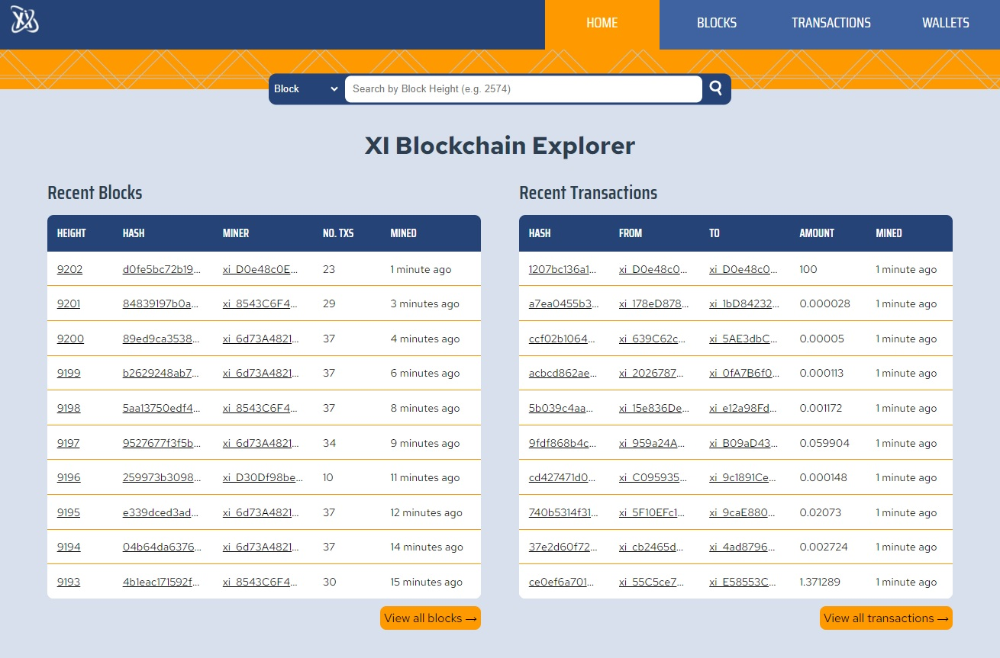
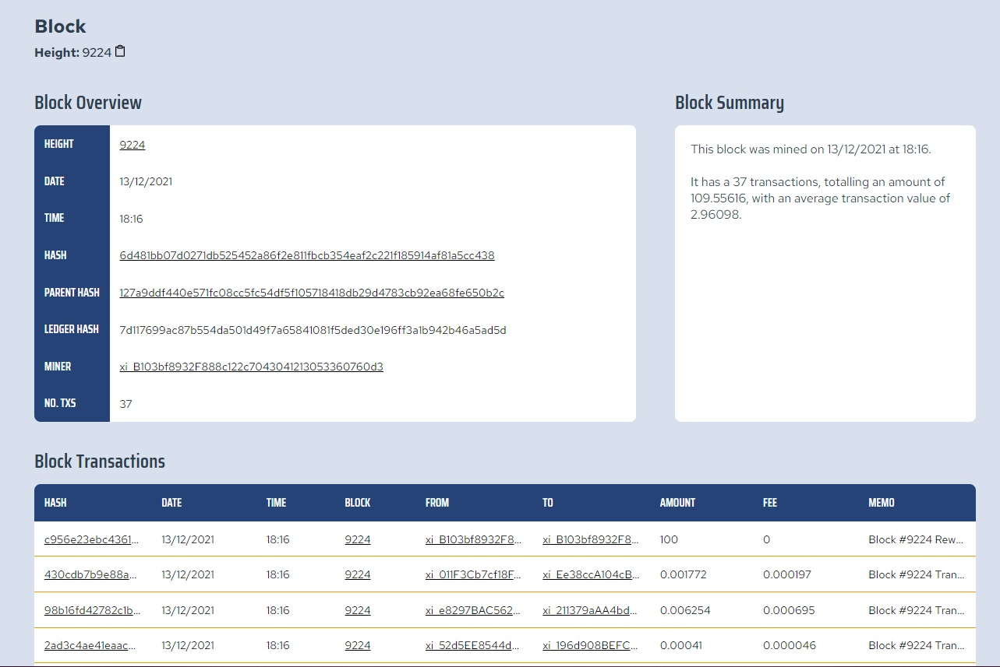
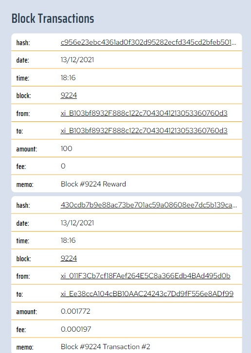

# XI Blockchain Explorer

A fully functional blockchain explorer for the imaginary cryptocurrency XI, built as an interview project for [Edge](https://edge.network/en/).

The app has been deployed at: [https://xi-blockchain-explorer.herokuapp.com](https://xi-blockchain-explorer.herokuapp.com)

## Screenshots

### Home page

Home page with summary of most recent blocks and transactions

### Block overview page

Block overview page with an overview table, summary box and list of transcations

### Collapsible tables

Tables collapse when viewing on mobile for easier readability

## Installation

**Note**: Although the project has been deployed, there have been issues at times where the site doesn't load. You can instead run the app locally if by following these instructions:

**Pre-requisite**: [Node.js](https://nodejs.org/en/download/) needs to be installed to run the server.

1 - Create a copy of the repository

- Clone the repository: `git clone https://github.com/willgarrett64/xi-blockchain-explorer.git`
- Navigate into the project folder `xi-blockchain-explorer`

2 - Run the local server

- Navigate into the `server` folder
- Install dependencies: `npm install`
- Run the server: `node server.js` - _note: the default port is 3000_

3 - Open the app in the browser

- Go to [http://localhost:3000](http://localhost:3000) in your browser

## Tech stack

### Frontend

- Vue.js
- Vue Router

### Backend

- Node.js
- Express.js

## XI Crytocurrency API

The data for the fake crypocurrency XI has been provided by the following API: [https://xi.test.network/](https://xi.test.network/)

The endpoints are:

- `/blocks` - returns the 10 most recent blocks
- `/blocks/latest` - returns just the single most recent block
- `/blocks/:height` - returns a specific block by height
- `/blocks/:height/transactions` - returns all transactions belonging to a specific block
- `/blocks/:height/transactions/:hash` - returns a specfic transaction by hash, belonging to a specific wallet
- `/transactions` - returns the 10 most recent transactions
- `/wallets` - returns all wallets
- `/wallets/:address` - returns a specific wallet by address

### Limitations

There were a number of challenges faced whislt developing this blockchain explorer due to limitations in the API data. The main limitations are:

- No "all blocks" or "all transactions" endpoint, and no pagination.
- Transaction data is missing its associated block
- Wallet data is missing a list of associated transactions
- Single transactions can't be searched by hash alone, but instead require a block height to also be known

With this limitations in mind, the only way to successfully obtain all data is by iterating through each block using the `blocks/:height` endpoing. At the time of writing there are over 9000 blocks so it is an unrealistic and expensive task to do so.

Therefore, I broke all the data down into pages of 10 items at a time. Using the page number, I calculated how many blocks/transactions/wallets I needed to skip before sending a response.

For example, if the latest block is 9000, and the user want page 5 of blocks data, the app will iterate from `blocks/8959` to `blocks/8950`, making a request to the API for each.

For transactions, the search is more expensive however. This is because there is no way of knowing the total amount of transactions or how many transactions belong to each block, so it's not possile to know where to begin the search. Therefore, the app will iterate through blocks and their transactions, skipping the required amount depending on page number. So, if page 70 of transactions was needed, the app will search through each block in turn, count the number of transactions until it reaches 700, and then start actually sending the data.

The most expensive task is obtaining the transactions associated with a wallet. Since there is no "all transactions list", to obtain this data the app has to perform the same iteration as above. The difference however, is that the chance of a block containing a transaction belonging to the specific wallet is quite low, so the app has to request data for and search through many more blocks, which means many more requests are done wastefully.

## Further development and known issues

There are still a number of features that haven't been implemented and known issues with the app which, given more time, would be included. These include efficiency in fetching data as well as some design flaws. The main ones are detailed below:

### Fetching data efficiency

As explained above, there are a number of problems with the API structure which cause data acquisition to be slow.

As the first 10 blocks and their transactions can easily be acquired through the `\blocks` endpoint, there is actually no need to iterate through each block one at a time for the first 10. To make the change, I would acquire these first 10 blocks and search the transactions in them, and only if the required data still wasn't found would I begin iterating through the remaining blocks/transcations.

I have also considered if there is a way to acquire transaction data in the background and save the data so there isn't a need to make these requests each time. However, as the data is ever evolving, any newly acquired data would need to be taken into account.

### Polling

Currently polling is used to fetch any updated data every minute. It has been predicted that around 95% of all data acquired through polling is redundant, so an alternative solution could prove better.

I have read about a service called [Pusher](https://pusher.com/) which is used for updating data in realtime, however it's not something I know enough about now to implement just yet.

In effect, I acknowledge the problem but don't yet have a solution.

### Mobile designs

Whislt the CSS was done with "mobile first" in mind, after deploying the app and opening it on my mobile, I noticed that I had been a bit conservative in the sizing of my browser during development, and was thus working on screens larger than the average mobile device.

The main issue revolves around the size of the main header, searchbar and loading spinner.

### Error handling

Currently there is a lack of proper error handling when it comes to fetching the data from the backend. Some basic error hadnling has been implemented, however as it stands if a fetch request is unsuccessful the loading spinner will keep going indefinitely rather than warning the user.
